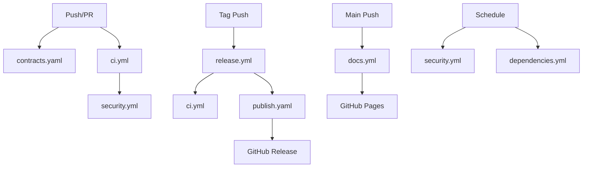

# GitHub Workflows Documentation

This document provides comprehensive documentation for all GitHub Actions workflows in the API Contracts repository.

## 📋 Table of Contents

- [Overview](#overview)
- [Workflow Descriptions](#workflow-descriptions)
- [Required Secrets](#required-secrets)
- [Branch Protection Rules](#branch-protection-rules)
- [Workflow Dependencies](#workflow-dependencies)
- [Best Practices](#best-practices)
- [Troubleshooting](#troubleshooting)

## Overview

The API Contracts repository uses a comprehensive CI/CD pipeline with the following workflows:

| Workflow                           | Trigger                  | Purpose                         | Duration |
| ---------------------------------- | ------------------------ | ------------------------------- | -------- |
| **CI/CD Pipeline**                 | Push, PR                 | Build and test all clients      | ~30 min  |
| **Proto Contracts Validation**     | Push, PR (proto changes) | Validate proto definitions      | ~10 min  |
| **Publish Packages**               | Tags, Manual             | Publish to package registries   | ~20 min  |
| **Release**                        | Tags, Manual             | Create GitHub releases          | ~45 min  |
| **Documentation**                  | Push (main), PR          | Generate and deploy docs        | ~20 min  |
| **Security & Dependency Scanning** | Push, Schedule (daily)   | Security vulnerability scanning | ~30 min  |
| **Dependency Updates**             | Schedule (weekly)        | Automated dependency updates    | ~10 min  |

### Current Modules

The repository currently contains the following proto modules:

| Module | Status | Proto Files | Description |
|--------|--------|-------------|-------------|
| **core** | ✅ Active | 8 files | Core multitenancy, context, errors, pagination, tenant management, audit logging |
| **idp** | 🚧 Planned | 0 files | Identity provider services (authentication, user management, RBAC) - skeleton only |

### Module Discovery

Workflows use **automatic module discovery** - they scan the `proto/` directory at runtime to find all modules. This means:

- ✅ **Adding a new module**: Just create a new directory under `proto/` with your `.proto` files - workflows will automatically discover and build it
- ✅ **No workflow edits needed**: Matrix strategies dynamically adjust to include all discovered modules
- ✅ **Each module is a separate package**: Generated, built, tested, and published independently for all languages (Rust, Python, TypeScript, Go, Java)
- ✅ **Independent versioning**: Each module/package can be versioned and published separately

**Example**: To add a `notification` module, simply create `proto/notification/` with your proto files. The next workflow run will automatically build clients for it across all languages.

## Workflow Descriptions

### 1. CI/CD Pipeline (`ci.yml`)

**Purpose**: Comprehensive continuous integration pipeline that validates, builds, and tests all client libraries.

**Triggers**:

- Push to `main`, `dev`, `develop`, `staging`
- Pull requests to these branches
- Manual dispatch

**Jobs**:

1. **discover-modules**: Automatically discovers all proto modules by scanning the `proto/` directory
2. **validate-proto**: Validates proto files with Buf (format, lint, breaking changes)
3. **generate-clients**: Generates client code for all languages
4. **build-rust**: Builds and tests Rust clients for all discovered modules (primary language)
5. **build-go**: Builds and tests Go clients for all discovered modules
6. **build-python**: Builds and tests Python clients for all discovered modules
7. **build-typescript**: Builds and tests TypeScript clients for all discovered modules
8. **build-java**: Builds and tests Java clients for all discovered modules
9. **security-scan**: Runs Trivy vulnerability scanner
10. **ci-success**: Final status check

> **Note**: Jobs 4-8 use **dynamic matrix strategies** that automatically discover all modules in `proto/`. When you add a new module directory to `proto/`, it will be automatically included in all build and test jobs without needing to modify workflow files.

**Features**:

- **Automatic Module Discovery**: Dynamically discovers all proto modules - no workflow changes needed when adding new modules
- **Consolidated Buf Action**: Uses `bufbuild/buf-action@v1` for enhanced integration
- **Automatic PR Comments**: Buf action automatically comments on PRs with validation results
- **Git Integration**: Enhanced Git data integration when working with Buf Schema Registry
- Parallel execution for faster builds
- Comprehensive caching for dependencies
- Dynamic matrix builds for all discovered packages
- Code coverage reporting
- Security audits (cargo-audit, etc.)
- Automatic cancellation of superseded runs

**Environment Variables**:

```yaml
BUF_VERSION: "1.47.2"
RUST_VERSION: "1.83.0"
PYTHON_VERSION: "3.12"
GO_VERSION: "1.23"
NODE_VERSION: "22"
JAVA_VERSION: "21"
PNPM_VERSION: "9"
```

### 2. Proto Contracts Validation (`contracts.yaml`)

**Purpose**: Specialized validation for Protocol Buffer definitions.

**Triggers**:

- Changes to `proto/**`
- Changes to `buf.yaml` or `buf.gen.yaml`
- Manual dispatch

**Jobs**:

1. **validate**: Format check, linting, breaking change detection
2. **check-dependencies**: Verify proto dependencies
3. **generate-clients**: Validate client generation
4. **statistics**: Generate proto statistics
5. **compare-schema**: Compare changes in PRs

**Features**:

- **Consolidated Buf Action**: Single action handles format, lint, and breaking changes
- **Automatic Status Comments**: Validation results posted directly on PRs
- **Enhanced Git Integration**: Better tracking of changes against base branches
- Breaking change detection with detailed reporting
- Automatic PR comments for breaking changes
- Proto statistics generation
- Schema comparison for PRs

### 3. Publish Packages (`publish.yaml`)

**Purpose**: Automated package publishing to various registries.

**Triggers**:

- Tags matching `v*.*.*` (including alpha, beta, rc)
- Manual dispatch with version input

**Jobs**:

1. **prepare**: Extract version, detect changed packages
2. **generate**: Generate clients from proto
3. **publish-rust**: Publish to crates.io
4. **publish-python**: Publish to PyPI
5. **publish-typescript**: Publish to NPM
6. **publish-go**: Tag Go modules
7. **publish-java**: Publish to Maven Central
8. **create-release**: Create GitHub release
9. **notify**: Send completion notifications

**Features**:

- Intelligent change detection
- Dry-run support
- Version management
- Pre-release support
- Comprehensive installation instructions in releases

**Required Secrets**:

- `CARGO_REGISTRY_TOKEN`: For crates.io
- `PYPI_API_TOKEN`: For PyPI
- `NPM_TOKEN`: For NPM
- `OSSRH_USERNAME`, `OSSRH_TOKEN`: For Maven Central
- `MAVEN_GPG_PRIVATE_KEY`, `MAVEN_GPG_PASSPHRASE`: For Maven signing

### 4. Release (`release.yml`)

**Purpose**: Comprehensive release management with changelog generation.

**Triggers**:

- Tags matching version patterns
- Manual dispatch with version input

**Jobs**:

1. **validate**: Validate release version and proto files
2. **ci**: Run full CI pipeline
3. **changelog**: Generate categorized changelog
4. **publish**: Publish packages
5. **create-release**: Create GitHub release with notes
6. **post-release**: Create release branch, update CHANGELOG.md
7. **notify**: Release notifications
8. **cleanup**: Clean up artifacts

**Features**:

- Automatic changelog generation from commits
- Categorized commit history (features, fixes, breaking changes)
- Release branch creation
- CHANGELOG.md updates
- Discussion creation for releases

### 5. Documentation (`docs.yml`)

**Purpose**: Generate and deploy API documentation.

**Triggers**:

- Push to `main` with doc changes
- Pull requests with doc changes
- Weekly schedule
- Manual dispatch

**Jobs**:

1. **generate-proto-docs**: Generate proto documentation (HTML & Markdown)
2. **build-docs-site**: Build MkDocs documentation site
3. **deploy-pages**: Deploy to GitHub Pages
4. **validate-links**: Check documentation links
5. **api-coverage**: Generate API coverage report

**Features**:

- Proto documentation generation with protoc-gen-doc
- MkDocs Material theme
- GitHub Pages deployment
- Link validation
- API coverage reporting
- PR comments with documentation changes

### 6. Security & Dependency Scanning (`security.yml`)

**Purpose**: Comprehensive security vulnerability scanning.

**Triggers**:

- Push to main/dev branches
- Pull requests
- Daily schedule (2 AM UTC)
- Manual dispatch

**Jobs**:

1. **dependency-review**: Review dependencies in PRs
2. **codeql**: CodeQL security analysis
3. **trivy-scan**: Trivy vulnerability scanner
4. **rust-audit**: Cargo audit for Rust
5. **python-audit**: Safety, Bandit, pip-audit for Python
6. **go-security**: gosec and govulncheck for Go
7. **npm-audit**: NPM audit for TypeScript
8. **secret-scan**: TruffleHog secret scanning
9. **license-check**: License compliance verification
10. **sbom-generation**: Generate Software Bill of Materials
11. **security-summary**: Aggregate security results

**Features**:

- Multi-language security scanning
- SARIF reports for GitHub Security
- License compliance checking
- Secret scanning
- SBOM generation (CycloneDX format)
- Automated security summaries

### 7. Dependency Updates (`dependencies.yml`)

**Purpose**: Automated dependency management.

**Triggers**:

- Weekly schedule (Monday 9 AM UTC)
- Manual dispatch

**Jobs**:

1. **update-proto-deps**: Update proto dependencies via Buf
2. **check-dependabot**: Verify/create Dependabot configuration
3. **update-toolchains**: Check for toolchain version updates

**Features**:

- Automated proto dependency updates
- Dependabot configuration management
- Toolchain version checking
- Automatic PR creation for updates

## Required Secrets

Configure these secrets in your GitHub repository settings:

### Package Publishing

```
CARGO_REGISTRY_TOKEN       # Rust crates.io token
PYPI_API_TOKEN            # Python PyPI token
NPM_TOKEN                 # NPM registry token
OSSRH_USERNAME            # Maven Central username
OSSRH_TOKEN               # Maven Central token
MAVEN_GPG_PRIVATE_KEY     # GPG key for Maven signing
MAVEN_GPG_PASSPHRASE      # GPG passphrase
```

### Optional

```
CODECOV_TOKEN             # For code coverage reporting
```

## Branch Protection Rules

Recommended branch protection settings for `main`:

```yaml
required_status_checks:
  strict: true
  checks:
    - "Validate Proto Files"
    - "Build & Test Rust / core"
    - "Build & Test Go / core"
    - "Build & Test Python / core"
    - "Build & Test TypeScript / core"
    - "Build & Test Java / core"
    - "Security Scan"
    - "CI Success"

required_pull_request_reviews:
  required_approving_review_count: 1
  dismiss_stale_reviews: true
  require_code_owner_reviews: true

enforce_admins: true
require_signed_commits: true
require_linear_history: true
allow_force_pushes: false
allow_deletions: false
```

## Workflow Dependencies



## Best Practices

### For Contributors

1. **Run Local Validation Before Pushing**

   ```bash
   make lint      # Lint proto files
   make format    # Format proto files
   make generate  # Generate clients
   make test      # Run tests
   ```

2. **Check Breaking Changes**

   ```bash
   buf breaking --against .git#branch=main,subdir=proto
   ```

3. **Test Client Generation**
   ```bash
   buf generate
   ```

### For Maintainers

1. **Creating Releases**

   ```bash
   # Create and push a version tag
   git tag -a v1.0.0 -m "Release v1.0.0"
   git push origin v1.0.0

   # Or use manual dispatch in GitHub Actions
   ```

2. **Emergency Hotfixes**

   ```bash
   # Create hotfix branch from release branch
   git checkout -b hotfix/1.0.1 release/1.0
   # Make fixes
   git tag -a v1.0.1 -m "Hotfix v1.0.1"
   git push origin v1.0.1
   ```

3. **Pre-release Testing**
   ```bash
   # Create pre-release tag
   git tag -a v1.0.0-rc.1 -m "Release Candidate 1"
   git push origin v1.0.0-rc.1
   ```

## Troubleshooting

### Common Issues

#### 1. Workflow Fails on Client Generation

**Problem**: `buf generate` fails
**Solution**:

- Check `buf.gen.yaml` syntax
- Ensure all proto dependencies are available
- Verify protoc plugins are installed

#### 2. Breaking Changes Detected

**Problem**: Proto validation fails due to breaking changes
**Solution**:

- Review the breaking changes carefully
- If intentional, bump major version
- Add migration guide to PR
- Use `buf skip breaking` in commit message to override (not recommended)

#### 3. Package Publishing Fails

**Problem**: Package fails to publish
**Solution**:

- Verify secrets are configured correctly
- Check package version doesn't already exist
- Ensure package build succeeds locally
- Review registry-specific requirements

#### 4. Security Scan Failures

**Problem**: Security vulnerabilities detected
**Solution**:

- Review vulnerability details in GitHub Security tab
- Update affected dependencies
- If false positive, create suppression rule
- Document acceptable risks

#### 5. Documentation Build Fails

**Problem**: MkDocs build fails
**Solution**:

- Check markdown syntax
- Verify all referenced files exist
- Test locally: `mkdocs serve`
- Check for broken links

### Getting Help

1. **Check Workflow Logs**: Navigate to Actions tab and review detailed logs
2. **Review PR Comments**: Automated comments often contain helpful information
3. **Check Security Tab**: For security-related issues
4. **Create Issue**: If problem persists, create an issue with workflow logs

## Maintenance Schedule

| Task                  | Frequency              | Workflow         |
| --------------------- | ---------------------- | ---------------- |
| Security Scans        | Daily (2 AM UTC)       | security.yml     |
| Dependency Updates    | Weekly (Mon 9 AM UTC)  | dependencies.yml |
| Documentation Rebuild | Weekly (Sun 12 AM UTC) | docs.yml         |
| SBOM Generation       | On every push          | security.yml     |

## Metrics and Monitoring

### Key Performance Indicators

- **Build Time**: Target < 30 minutes for CI
- **Test Coverage**: Target > 80%
- **Security Vulnerabilities**: Target = 0 high/critical
- **Breaking Changes**: Tracked and documented
- **Package Publish Success Rate**: Target > 95%

### Monitoring

- GitHub Actions dashboard for workflow status
- GitHub Security tab for vulnerability tracking
- GitHub Insights for contributor metrics
- Package registry pages for download statistics

## Updates and Versioning

This documentation is maintained alongside the workflows. When updating workflows:

1. Update the workflow file
2. Update this documentation
3. Test in a feature branch
4. Create PR with both changes
5. Update version in workflow comments

**Last Updated**: November 2025
**Workflow Version**: 2.0.0
**Maintained By**: DevOps Team

---

For questions or suggestions, please create an issue or discussion in the repository.
